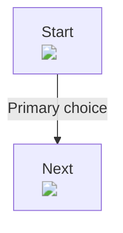

# Wiki-Driven Development

Wiki-Driven Development (WDD) treats the product wiki as the SSOT. The Next.js app is not compiled deterministically from the wiki; an agent reads the wiki, updates the wiki first, traces impact, edits referenced code, and verifies the result.

## Repository Shape

```txt
wiki/        product SSOT Markdown in downstream projects
harness/     WDD playbooks, contracts, templates, lint, impact, screenshot, and ready checks
AGENTS.md    agent entry point that forces the wiki-first workflow
```

This repository currently dogfoods the harness with the mini booking pilot, but the durable target shape for downstream Next.js projects is "default Next.js app plus `wiki/`, `harness/`, and `AGENTS.md`." The wiki is read as Markdown in GitHub, local editors, Obsidian, Codex, Claude, or any other Markdown-aware tool.

## Core Flow

Every product change starts from an accepted GitHub Issue unless the user explicitly asks for a local spike. The issue works like a small PRD: target wiki nodes, new wiki nodes, acceptance criteria, QA expectations, and evidence needs.

Agents then choose one playbook:

- `harness/playbooks/change.md`: normal product change or wiki maintenance.
- `harness/playbooks/legacy-migration.md`: existing code-SSOT to wiki-SSOT migration.
- `harness/playbooks/repair.md`: bug fix, evidence refresh, or hotfix.

The normal flow is:

1. Update the wiki node that owns the behavior, plus impacted wiki nodes.
2. Run `wdd impact` or read dependencies to find affected screens and files.
3. Edit only referenced code, or update the wiki first if ownership metadata was wrong.
4. Run declared tests, E2E, QA screenshots, `wdd status`, and `wdd drift`.
5. Use `wdd mark` to mark impacted nodes honestly, run `wdd ready`, and open a PR that links the issue.

If work stops mid-flow, leave `wdd_status` in the current phase. A reader should be able to see whether the wiki is implemented and verified.
Agents and CI should update that status with `wdd mark` so hidden metadata and the human `## 상태` line stay synchronized.

## User Experience

Product users should not need to learn `wdd` commands. Their interface is the Markdown wiki itself:

- `wiki/*.md` is the SSOT and GitHub Markdown is the primary reading surface;
- HTML renderers are optional derived artifacts, not the source of truth;
- `wdd_status` in hidden WDD metadata is the machine-readable status truth;
- the `## 상태` line is the human-readable status summary and must match `wdd_status`;
- impact, implementation metadata, verification files, and commands live in collapsible Markdown `<details>` sections;
- evidence remains in wiki metadata and screen screenshots.

The harness exists for agents, developers, and CI. Agents run the commands, then reflect the result back into wiki metadata and screenshots.

For screen-owning nodes, screenshots are required once the node is reflected in code or verified. A reflected screen without a screenshot is not ready, because the wiki reader cannot confirm what actually shipped.

For user changes, the product wiki should be read-mostly until work is picked up. New requests enter through GitHub Issues, not through product wiki nodes. An issue names the target product wiki nodes and proposed patch; after an agent applies the patch, updates code, verifies, and refreshes screenshots, the product wiki becomes the final SSOT again through the PR.

A request like "change this wiki node like this" should create or update a GitHub issue first, not edit the product node directly. The issue can include the exact intended product wiki wording, new node list, or section replacement, then the implementation branch moves that content into the product wiki and continues through coding, verification, screenshots, and PR review.

## GitHub Work Layer

GitHub Issues and PRs are the active work layer:

- Issue: intent, target product wiki nodes, proposed wiki patch, likely code targets, verification plan, dependencies.
- Branch/worktree: isolated execution of one picked-up issue or one independent child issue.
- PR: the durable change set containing product wiki patch, code patch, tests, screenshots, and evidence.
- Merge: the point where product wiki truth changes for everyone.

PR descriptions should use `Closes #<issue>` only when the issue acceptance criteria are fully satisfied. Use `Refs #<issue>` for partial or related work. When a parent issue is split into child issues, each PR closes its child issue and updates the parent checklist or links.

Useful `gh` CLI flow:

```bash
gh issue create --template wdd-change.md --title "[WDD] <change>"
gh issue list --label wdd --state open
gh issue view <number>
gh issue edit <number> --add-assignee @me
git switch -c codex/issue-<number>-<slug>
gh pr create --fill
```

## Legacy Migration Lane

For an existing Next.js repository, WDD starts by admitting that the old code is still the truth. The migration lane moves one product slice at a time from code-SSOT to wiki-SSOT without pretending that documentation alone is enough.

Keep a repo-root `legacy-map.json` for file-level tracking. Generate the first map from tracked files, excluding WDD-owned surfaces:

```bash
npm run wdd -- legacy init .
npm run wdd -- legacy status .
```

Legacy statuses move in this order:

```txt
code-ssot -> observed -> specified -> spec-frozen -> blind-implemented -> parity-reviewed -> wiki-ssot -> retired
```

The slice-level rule is strict:

- Before extraction, build a node projection matrix. Every route, screen state, API, mutation, 앱객체 shape, DB테이블, branch, policy, integration, and visual state must map to a required WDD node type or an explicit gap.
- `observed`: extractor may inspect legacy code and the running product, capture screens, APIs, events, analytics, guards, error states, storage, and hidden behavior.
- `specified`: durable product behavior is written into wiki nodes with screenshots, QA scenarios, event/API contracts, and known gaps. Legacy file provenance stays in `legacy-map.json` and the issue, not in product wiki metadata.
- `spec-frozen`: the wiki is frozen as the implementation spec for that slice.
- `blind-implemented`: implementer reads only the frozen wiki, selected evidence, QA, and event/API specs. The legacy code for that slice is off-limits.
- `parity-reviewed`: reviewer compares the new implementation against legacy evidence and records gaps.
- `wiki-ssot`: only after blind implementation and parity review pass does the wiki become the proven truth for that slice.

Raw observation captures should stay in the GitHub Issue PRD/evidence section or temporary work artifacts. Copy only durable product evidence into the owning wiki node's sidecar folder when that node embeds it.

Projection is structural, not prose. A screen that mentions `/api/...`, DB tables, storage, payloads, guards, or loading/error branches must depend on the corresponding 액션 (`action`), DB테이블 (`entity`), 앱객체 (`model`), 정책 (`policy`), and QA (`qa`) nodes. Likewise, `legacy-map.json` entries for legacy API files such as `pages/api/...` must be covered by an 액션 node; persistence files must be covered by a DB테이블 node. A screen node alone is not enough coverage for API or DB behavior.

## Node Types

- DB테이블 (`entity`): persistence contract, columns, lifecycle, constraints.
- 앱객체 (`model`): app-facing request, response, DTO, validation, and typed shape.
- 액션 (`action`): mutation/write API contract.
- 화면 (`screen`): route, visible states, user actions, screenshots.
- 흐름 (`flow`): generated screen tree capture, Mermaid source, and cross-screen handoff contract.
- 정책 (`policy`): cross-cutting business rule.
- QA (`qa`): executable scenarios and edge cases.
- 디자인 (`design`): product UI tokens and state expression.
- 용어 (`term`): glossary and non-generated knowledge.

## Hidden WDD Metadata Contract

```md
<!-- wdd
id: screens/example-screen
type: screen
title: Example Screen
wdd_status:
  phase: coding
  code: pending
  verification: pending
depends_on:
  - models/example-model
implemented_by:
  - <appRoot>/src/app/examples/[id]/page.tsx
verified_by:
  - <appRoot>/tests/e2e/example-screen.spec.ts
artifacts:
  - <appRoot>/src/app/examples/[id]/_components/example-screen.tsx
assets:
  - path: public/images/example-hero.png
    purpose: Hero image shown above the form
    source: Product design handoff
screenshots:
  - path: <wikiRoot>/화면/example-screen/스크린샷.png
    alt: Example screen after QA passes
    route: /examples/example-id
verify:
  - npm run e2e -- example-screen
-->
```

The metadata is ordinary YAML wrapped in `<!-- wdd ... -->` so GitHub Markdown readers start at the title instead of showing a raw metadata table. Use YAML block lists for paths containing brackets, such as `bookings/[id]/page.tsx`. Inline YAML arrays can misread `[id]`.

`implemented_by` records code that currently implements the wiki node from wiki truth. During legacy observation or spec freeze, keep it empty even if the legacy app already has matching files. Old file provenance belongs in `legacy-map.json` and the active GitHub Issue.

`assets` records product assets the implementation uses, such as `public/...` images, fonts, media, or external CDN assets. This is separate from `screenshots` and `mockups`, which are wiki evidence. Local product assets are checked by `wdd ready`; external assets should still record source and license or ownership.

During legacy extraction, wiki nodes are candidates derived from code-SSOT. They must not claim wiki-derived implementation status. Use `legacy` metadata and keep `wdd_status` honest:

```md
<!-- wdd
id: screens/legacy-home
type: screen
title: Legacy Home
wdd_status:
  phase: wiki
  code: pending
  verification: pending
legacy:
  status: observed
-->
```

`legacy` metadata in product wiki is deliberately tiny: only `status` belongs there. Do not add `legacy_sources`, `implementation_targets`, `legacy.sources`, or `legacy.evidence` to a wiki node. `wdd ready` fails when `legacy.status` is `code-ssot`, `observed`, `specified`, or `spec-frozen` while the node claims `code: reflected`, `verification: passed`, `phase: verified`, or a non-empty `implemented_by`.

## Wiki Evidence

Top-level folders under `wiki/` are reader-facing node categories. Do not create a new top-level folder for raw screenshots, mockups, flow captures, or other non-node evidence.

Use a sidecar folder next to the owning wiki node for committed evidence that the node embeds:

```txt
wiki/화면/example-screen.md
wiki/화면/example-screen/스크린샷.png
wiki/화면/example-screen/목업.html

wiki/흐름/example-flow.md
wiki/흐름/example-flow/화면트리.png
```

During legacy migration, raw observation captures belong to the active issue PRD/evidence section or a temporary work artifact until selected evidence is attached to a wiki node. Once attached, copy only the durable evidence into the owning node's sidecar folder and embed it from the Markdown body.

Every wiki Markdown file also exposes a canonical human status line:

```md
## 상태

상태: 🛠️ 코드 반영 필요 · 코드 대기 · 검증 대기
```

That line is not free text. The harness derives the exact allowed line from `wdd_status` and `wdd ready` fails when the Markdown line drifts.

Implementation metadata should stay readable but out of the main narrative:

```md
<details>
<summary>영향 범위와 구현 메타</summary>

- 노드: `screens/example-screen`
- 의존: [[models/example-model]]
- 구현: `<appRoot>/src/app/examples/[id]/page.tsx`
- 검증 파일: `<appRoot>/tests/e2e/example-screen.spec.ts`
- 검증 명령: `npm run e2e -- example-screen`

</details>
```

Screen-owning nodes must also show shipped visual evidence inline in the body:

```md
## 화면 증거

```

Flow nodes should show a generated screen tree capture first, then keep the Mermaid source in a collapsible section. During QA, agents and CI refresh screen screenshots first and then regenerate flow tree captures from that Mermaid source plus the referenced screen screenshots. `wdd ready` fails when a verified flow is missing the generated capture, when that capture file is missing, or when the Mermaid source does not reference dependent screen screenshots:

```md
## 화면 트리


<details>
<summary>Mermaid source</summary>



</details>
```

## Agent/CI Commands

```bash
npm run dev        # product app on http://127.0.0.1:3001
npm run wdd -- index wiki
npm run wdd -- impact wiki actions/create-booking
npm run wdd -- session wiki actions/create-booking
npm run wdd -- mark wiki actions/create-booking --phase verification --code reflected --verification pending --with-impact
npm run wdd -- status wiki
npm run wdd -- drift wiki .
npm run wdd -- screenshots wiki
npm run wdd -- flow-trees wiki . --json
npm run wdd -- legacy status .
npm run wdd -- ready
```

These commands are not the product-user interface. They are the harness controls that agents and CI use to keep the wiki, code, and verification evidence aligned.

`wdd ready` is the project-neutral static gate. It checks workflow status, canonical Markdown status summaries, referenced files, screenshot contracts, and verify-command declarations.

`npm run ready` is this repository's full dogfood gate. It runs harness tests, product app tests, builds, product QA, screen screenshot capture, flow tree capture, and then `wdd ready`.

## Starting Another Next.js App

Use the pilot as a dogfood reference, not as a required shape. For an existing Next.js boilerplate, add WDD as a project layer instead of reshaping the whole app.

```txt
app/ or src/app/         existing Next.js App Router product app
public/                  existing Next.js assets, if present
wiki/                    product SSOT Markdown
wiki/QA/                 executable coverage and edge-case proof
harness/                 WDD rules, scripts, templates, and evidence conventions
legacy-map.json          only for existing-code migrations; tracks code-SSOT files by file
.github/ISSUE_TEMPLATE/  WDD change intake
.github/PULL_REQUEST_TEMPLATE.md
AGENTS.md                thin pointer that forces agents to follow harness/ first
```

Minimum setup:

1. Start from a normal Next.js project. Keep its `app/` or `src/app/` choice.
2. Create an empty `wiki/`. Do not copy this repository's dogfood `wiki/`; it is a mini booking example, not starter truth.
3. Create product nodes only as needed by copying the matching file from `harness/templates/*.md`, renaming it to the real product node, and replacing placeholder paths.
4. Keep WDD playbooks, contracts, templates, scripts, and tests in `harness/`.
5. Copy `harness/templates/AGENTS.md` to the repo root and keep `harness/AGENTS.md` inside the harness folder.
6. Add harness configuration under `harness/` or wire it through package scripts, setting `wikiRoot`, `repoRoot`, and `appRoot`.
7. Put real repo-relative paths in hidden WDD metadata. Use block YAML lists for paths with brackets such as `app/src/app/items/[id]/page.tsx`.
8. Keep `## 상태` lines generated from hidden WDD metadata. Do not invent custom status prose.
9. For screen-owning nodes, keep screenshot paths repo-relative in metadata, for example `wiki/화면/example/스크린샷.png`, set `screenshots.route` to a route the product app can render during QA, and embed the screenshot as a Markdown image in the body.
10. For flow nodes, embed a generated capture such as `wiki/흐름/example-flow/화면트리.png`, keep Mermaid source below it, and reference dependent screen screenshots through `` inside that Mermaid source.
11. Do not invent top-level wiki folders while collecting evidence. If evidence is not ready to become product truth, attach it to the GitHub Issue PRD/evidence section instead.
12. For a legacy app, copy `harness/templates/legacy-map.json` to repo-root or run `npm run wdd -- legacy init .`, then migrate one accepted GitHub Issue slice at a time.
13. Route user changes through GitHub Issues and PRs. Issues hold work-in-progress intent; merged product wiki nodes hold truth.
14. Keep historical plans out of the repo unless they are active issues or PR notes. Durable decisions belong in `wiki/`, `harness/`, templates, tests, or README.

Recommended Next.js scripts:

```json
{
  "scripts": {
    "dev": "next dev -p 3001",
    "build": "next build",
    "test": "vitest run",
    "e2e": "playwright test",
    "wiki:screenshots": "node scripts/capture-wiki-screenshots.mjs",
    "wiki:flow-trees": "node scripts/capture-wiki-flow-trees.mjs",
    "qa": "npm run e2e && npm run wiki:screenshots && npm run wiki:flow-trees"
  }
}
```

The harness can guide and verify the workflow, but the agent still writes product code by reading the wiki.
