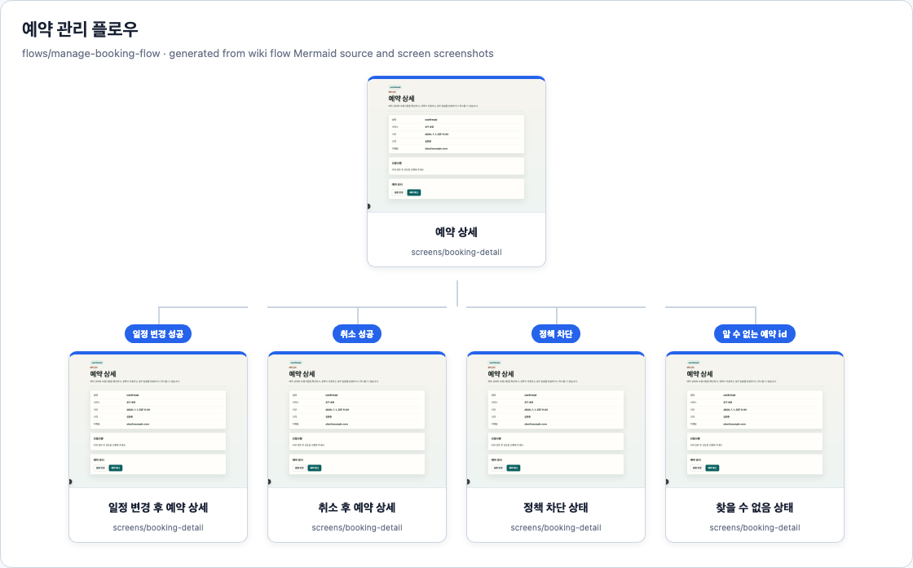
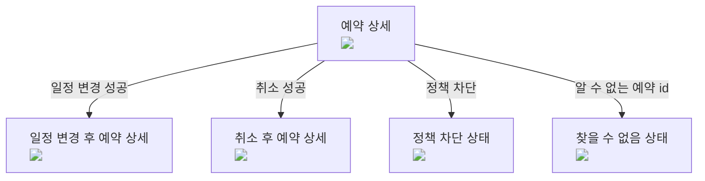

<!-- wdd
id: flows/manage-booking-flow
type: flow
title: 예약 관리 플로우
summary: 기존 예약의 일정 변경 또는 취소 흐름.
wdd_status:
  phase: verified
  code: reflected
  verification: passed
depends_on:
  - screens/booking-detail
  - actions/reschedule-booking
  - actions/cancel-booking
  - policies/cancellation-policy
implemented_by:
  - tests/e2e/reschedule-booking.spec.ts
  - tests/e2e/cancel-booking.spec.ts
verified_by:
  - tests/e2e/reschedule-booking.spec.ts
  - tests/e2e/cancel-booking.spec.ts
artifacts:
  - tests/e2e/reschedule-booking.spec.ts
  - tests/e2e/cancel-booking.spec.ts
  - wiki/자료/흐름/예약-관리-화면트리.png
verify:
  - npm run e2e -- reschedule-booking
  - npm run e2e -- cancel-booking
-->
# 예약 관리 플로우

## 상태

상태: ✅ 검증 완료 · 코드 반영됨 · 검증 통과

영향 범위와 구현 메타

- 노드: `flows/manage-booking-flow`
- 타입: `flow`
- 의존: [[screens/booking-detail]], [[actions/reschedule-booking]], [[actions/cancel-booking]], [[policies/cancellation-policy]]
- 구현: `tests/e2e/reschedule-booking.spec.ts`, `tests/e2e/cancel-booking.spec.ts`
- 검증 파일: `tests/e2e/reschedule-booking.spec.ts`, `tests/e2e/cancel-booking.spec.ts`
- 산출물: `tests/e2e/reschedule-booking.spec.ts`, `tests/e2e/cancel-booking.spec.ts`, `wiki/자료/흐름/예약-관리-화면트리.png`
- 스크린샷: `wiki/자료/흐름/예약-관리-화면트리.png`
- 검증 명령: `npm run e2e -- reschedule-booking`, `npm run e2e -- cancel-booking`

## 화면 트리

Mermaid 소스

## 의도
고객이 취소 정책을 지키면서 활성 예약을 관리할 수 있게 한다.

## 단계
1. [[screens/booking-detail]]을 연다.
2. [[actions/reschedule-booking]]으로 일정을 변경하거나 [[actions/cancel-booking]]으로 취소한다.
3. 상세 화면에 머물며 갱신된 상태를 보여준다.

## 전달 계약

| 출발 | 도착 | 데이터 | 검증 |
|---|---|---|---|
| 예약 상세 라우트 | [[screens/booking-detail]] | `bookingId` | 상세 화면이 일치하는 예약을 로드함 |
| [[actions/cancel-booking]] | [[screens/booking-detail]] | 갱신된 예약 상태 | 상세 화면이 취소 상태를 보여줌 |
| [[actions/reschedule-booking]] | [[screens/booking-detail]] | 갱신된 슬롯 id | 상세 화면이 새 슬롯을 보여줌 |

## 플로우 QA
- given 정책 경계 밖 활성 예약 / when 취소 / then 상세 화면이 취소 상태를 보여준다
- given 정책 경계 밖 활성 예약 / when 일정 변경 / then 상세 화면이 새 슬롯을 보여준다
- given 정책으로 차단된 예약 / when mutation 시도 / then 상태 변화가 없다
