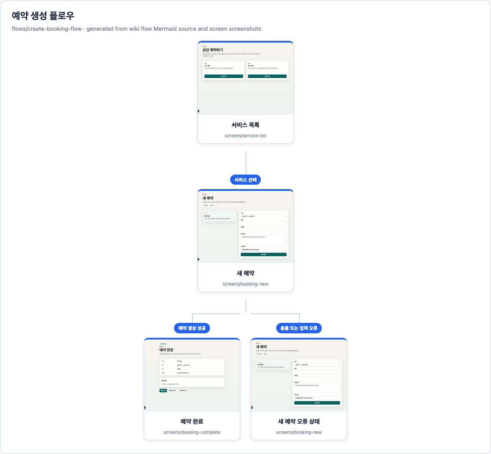
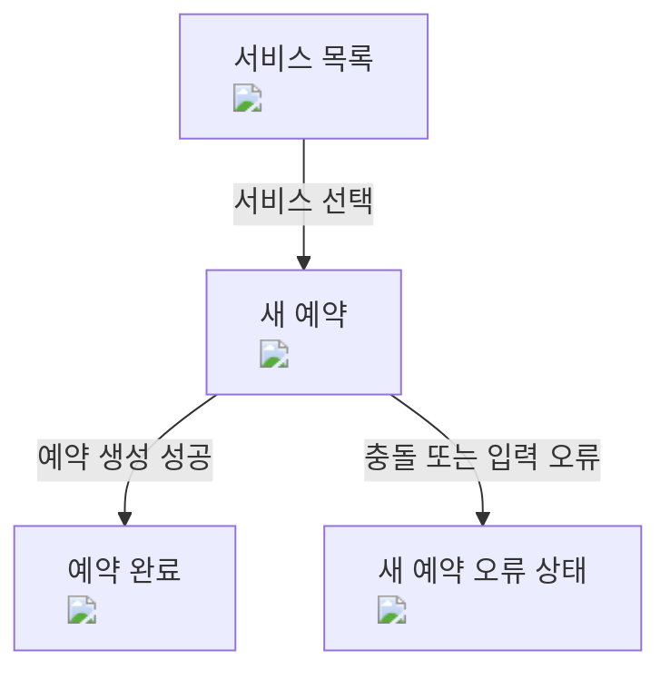
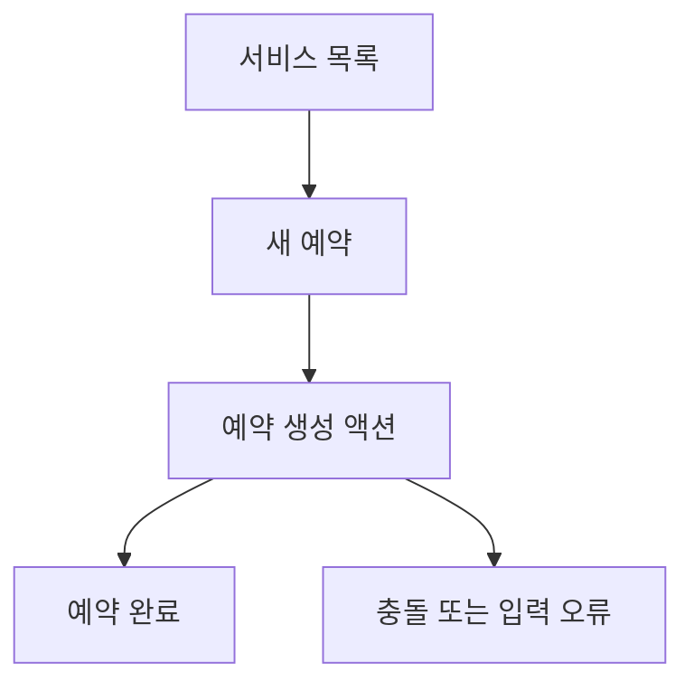

<!-- wdd
id: flows/create-booking-flow
type: flow
title: 예약 생성 플로우
summary: 서비스 선택부터 예약 확인까지의 흐름.
wdd_status:
  phase: verified
  code: reflected
  verification: passed
depends_on:
  - screens/service-list
  - screens/booking-new
  - screens/booking-complete
  - actions/create-booking
implemented_by:
  - tests/e2e/create-booking.spec.ts
verified_by:
  - tests/e2e/create-booking.spec.ts
artifacts:
  - tests/e2e/create-booking.spec.ts
  - wiki/흐름/예약-생성/화면트리.png
verify:
  - npm run e2e -- create-booking
-->
# 예약 생성 플로우

## 상태

상태: ✅ 검증 완료 · 코드 반영됨 · 검증 통과

영향 범위와 구현 메타

- 노드: `flows/create-booking-flow`
- 타입: `흐름` (`flow`)
- 의존: [[screens/service-list]], [[screens/booking-new]], [[screens/booking-complete]], [[actions/create-booking]]
- 구현: `tests/e2e/create-booking.spec.ts`
- 검증 파일: `tests/e2e/create-booking.spec.ts`
- 산출물: `tests/e2e/create-booking.spec.ts`, `wiki/흐름/예약-생성/화면트리.png`
- 스크린샷: `wiki/흐름/예약-생성/화면트리.png`
- 검증 명령: `npm run e2e -- create-booking`

## 화면 트리

Mermaid 소스

## 의도
고객이 서비스를 고른 뒤 확정 예약을 확인하기까지 안내한다.

## 단계
1. [[screens/service-list]]에서 시작한다.
2. 서비스를 고르고 [[screens/booking-new]]로 이동한다.
3. 연락처, 선택적 요청사항, 선택적 요청 사진으로 [[actions/create-booking]]을 제출한다.
4. [[screens/booking-complete]]에 도착한다.

## 플로우 다이어그램

## 전달 계약

| 출발 | 도착 | 데이터 | 검증 |
|---|---|---|---|
| [[screens/service-list]] | [[screens/booking-new]] | `serviceId` | 새 예약 화면이 선택한 서비스를 로드함 |
| [[screens/booking-new]] | [[actions/create-booking]] | `serviceId`, `slotId`, 연락처, `customerNote?`, `requestPhoto?` | 액션이 예약, 요청사항, 요청 사진을 저장함 |
| [[screens/booking-new]] | [[screens/booking-complete]] | `bookingId` | 완료 화면이 생성된 예약, 요청사항, 요청 사진을 로드함 |

## 플로우 QA
- given 활성 서비스와 예약 가능 슬롯 / when 고객이 폼 완료 / then 확인 화면이 나타난다
- given 요청사항 포함 / when 고객이 폼 완료 / then 확인 화면과 상세 화면에서 요청사항이 보인다
- given 요청사항 사진 포함 / when 고객이 폼 완료 / then 확인 화면과 상세 화면에서 첨부 사진이 보인다
- given 제출 전 슬롯이 booked가 됨 / when 고객이 제출 / then 충돌이 보이고 확인 화면은 나타나지 않는다
